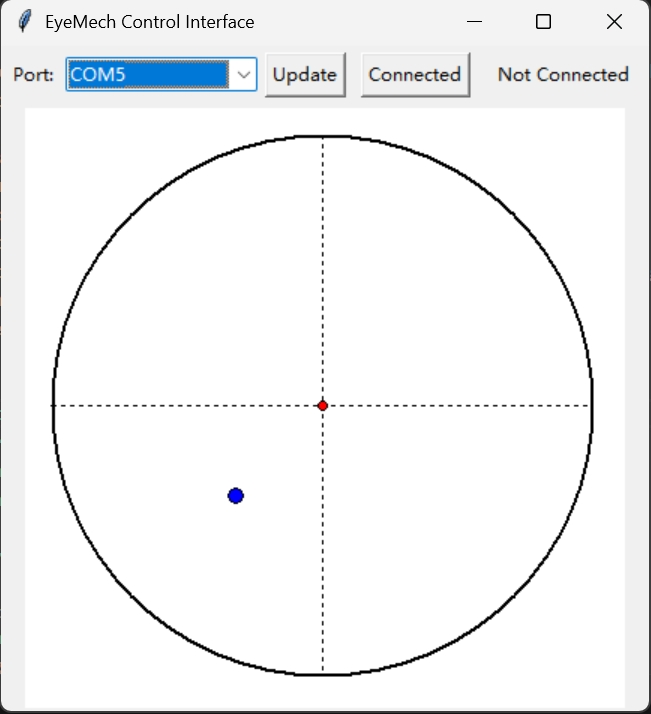

# EyeMech Control Interface

**EyeMech Control Interface** is a desktop application that provides an intuitive way to control a 3D eyeball mechanism using mouse interactions. Built upon Will Cogley’s EyeMech 1.0 hardware design, this project integrates a Python‑based GUI with custom Arduino firmware to enable real‑time eye movements, blinking, and eyelid adjustments. It is ideal for makers, educators, and robotics enthusiasts interested in experimenting with animatronic eye control.



---

## Features

* **Eye tracking**: Click and drag on the canvas to direct the eyeball.
* **Blink**: Right‑click to trigger a blink.
* **Eyelid control**: Use the mouse wheel to open or close the eyelid incrementally.
* **Serial Port Management**: Select, update, and connect to available COM ports.

## Hardware Requirements

* EyeMech hardware assembly (servos, eyeball mount, frame)
* Arduino Uno (or compatible board)
* USB cable to connect Arduino to your computer

## Software Requirements

* **Python 3.7+**
* **Tkinter** (usually included with Python)
* **pyserial**
* **numpy**
* **Arduino IDE** (for uploading firmware)

> **Tested on Windows (10/11) with Python 3.11.9.**

## Installation

1. **Clone this repository**

   ```bash
   git clone https://github.com/<your-username>/EyeMech-Control-Interface.git
   cd EyeMech-Control-Interface
   ```

2. **Install Python dependencies**

   ```bash
   pip install pyserial numpy
   ```

3. **Upload Arduino firmware**

   1. Open `Arduino/eye_mech_interface/eye_mech_interface.ino` in the Arduino IDE.
   2. Select your board (e.g., Arduino Uno) and COM port.
   3. Click **Upload**.

4. **Run the GUI**

   ```bash
   python Interface.py
   ```

## Usage

1. **Port Selection**

   * The dropdown lists all detected serial ports.
   * Click **Update** to refresh the list.
2. **Connect**

   * Choose a port and click **Connect**.
   * Status will show `Connected: <port>@<baudrate>` on success.
3. **Interactive Controls**

   * **Left-click & drag**: Move the red dot within the circular radar—translates to eye look direction.
   * **Right-click**: Send a blink command.
   * **Mouse wheel**: Increase or decrease eyelid opening angle.

## Project Structure

```
EyeMech-Control-Interface/
├── README.md                      # This file
├── Interface.py                   # Python Tkinter GUI
├── Arduino/                       # Arduino firmware folder
│   └── eye_mech_interface/
│       └── eye_mech_interface.ino # Arduino firmware sketch
└── LICENSE                        # License file
```

## Original Documentation

Based on EyeMech 1.0 by Will Cogley – see [documentation](https://willcogley.notion.site/EyeMech-1-0-983e6cad7059410d9cb958e8c1c5b700).

## License

This project incorporates original work by Will Cogley licensed under Creative Commons Attribution-NonCommercial-ShareAlike 4.0 International (CC BY-NC-SA 4.0).

[](http://creativecommons.org/licenses/by-nc-sa/4.0/)

You are free to share and adapt this material under the following terms:

* **Attribution**: You must give appropriate credit to the original author (Will Cogley).
* **NonCommercial**: You may not use this work for commercial purposes.
* **ShareAlike**: If you remix or transform this work, you must distribute your contributions under the same license.

If you'd like to use this work in a commercial application, please contact [enquiries@willcogley.com](mailto:enquiries@willcogley.com).

All new code and content added in this repository (GUI, firmware, documentation) are also licensed under CC BY-NC-SA 4.0 to comply with the original share‑alike requirement.
